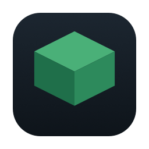
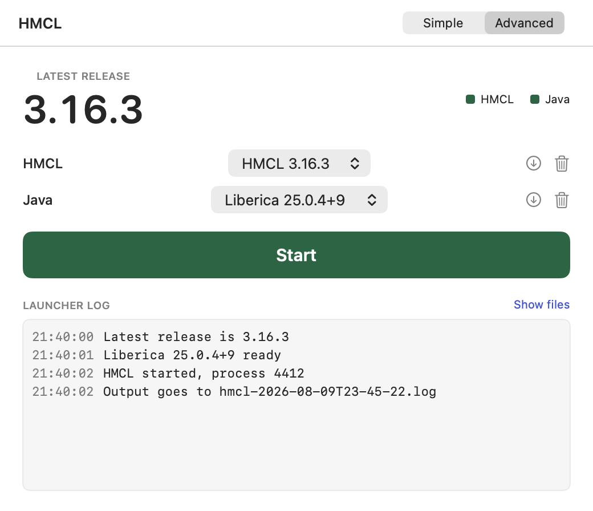

<div align="center">


# HMCL Launcher

[](https://github.com/thomaslty/HMCL-launcher/releases)
[](https://github.com/thomaslty/HMCL-launcher/actions/workflows/release.yml)
[](https://github.com/thomaslty/HMCL-launcher/releases)
[](https://github.com/thomaslty/HMCL-launcher/stargazers)

**Press one button and Minecraft opens. No Java to install first.**
</div>

> This is a front door for [HMCL](https://github.com/HMCL-dev/HMCL), not a fork of it. It only downloads HMCL and a Java to run it on — it never touches the Java you already have, and it never moves your worlds.

<div align="center"></div>

## Contents

- [Features](#features)
- [Quick start](#quick-start)
- [Configuration](#configuration)
- [How it works](docs/how-it-works.md)

## Features

- **Never install Java to play**: it fetches its own and keeps it to itself, so whatever you already have on the machine keeps working exactly as before
- **Always on the current HMCL**: it reads the latest release itself, so you stop hunting GitHub for a jar
- **Close the launcher, keep playing**: quitting this window leaves your game running
- **Your worlds stay yours**: saves live where they always did, and nothing is copied into a private folder you would have to find later
- **Undo the whole thing**: drag one folder to the Trash and the machine is back to how it started

## Quick start

Download the `.dmg` from [Releases](https://github.com/thomaslty/HMCL-launcher/releases), drag the app to Applications, then open it.

The app is ad-hoc signed rather than notarized, so the first launch is blocked:

- click Done on the warning
- open System Settings → Privacy & Security, scroll to Security, click Open Anyway and enter your password
- open the app again and click Open Anyway
- if it says "app is damaged" instead, run `xattr -dr com.apple.quarantine "/Applications/HMCL Launcher.app"`

Apple removed the right-click → Open shortcut in macOS 15 ([details](https://mjtsai.com/blog/2024/07/05/sequoia-removes-gatekeeper-contextual-menu-override/)).

Building it yourself needs Xcode and nothing else:

```bash
swift test                      # 42 tests, no network
./scripts/build-app.sh          # build/HMCL Launcher.app
./scripts/make-dmg.sh           # dist/HMCL-Launcher-<version>.dmg
```

## Configuration

Nothing to set to boot. The app writes one folder, `~/Library/Application Support/net.tlau.HMCLLauncher/`, and hands HMCL these three so HMCL's own downloads land there too.

| Variable | Required | Default | What it does |
|---|---|---|---|
| `HMCL_USER_HOME` | set by the app | `<workspace>/hmcl-home` | HMCL's config, accounts, and the Java it downloads for the game |
| `HMCL_LOCAL_HOME` | set by the app | `<workspace>/hmcl-local` | HMCL's cache and its own logs |
| `HMCL_DEPENDENCIES_DIR` | set by the app | `<workspace>/hmcl-deps` | HMCL's library cache |
| `HMCL_INTEGRATION` | to run the live test | unset | `=1` lets `swift test --filter EndToEnd` download for real |

Two flags exist for looking at the UI without Screen Recording permission, see [docs/how-it-works.md](docs/how-it-works.md).

## Known gaps

- Intel Macs are not built
- HMCL self-update is pointed at a dead URL, that is not a documented switch and may stop working
