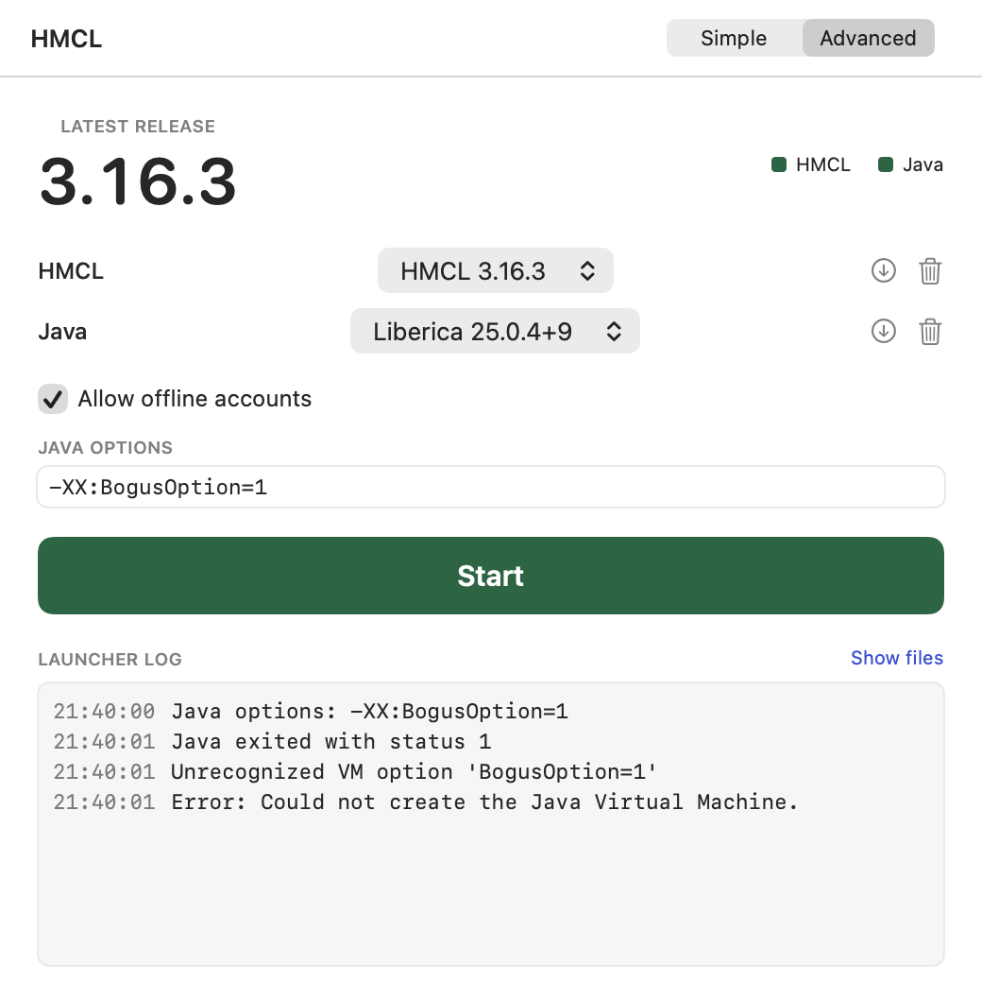

# How it works

## What lands on disk

Everything sits in `~/Library/Application Support/net.tlau.HMCLLauncher/`, like `runtimes/liberica-25.0.4+9/`.

- `runtimes/` — the downloaded Java, about 420 MB once unpacked
- `launchers/` — `HMCL-<version>.jar`, about 10 MB each
- `hmcl-home/`, `hmcl-local/`, `hmcl-deps/` — handed to HMCL so its own downloads stay here
- `logs/` — `hmcl-<timestamp>.log` holds HMCL's stdout, the Advanced-mode log pane does not
- `state.json`, `release-cache.json` — your last selection, and the GitHub ETag

Your system Java is untouched, `/usr/libexec/java_home` never sees the downloaded one.

## Where your saves go

HMCL resolves its game directory as `.minecraft` relative to the working directory, so the app runs it from your home folder and saves land in `~/.minecraft`. Nothing is copied into the workspace.

## Why Liberica Full and not Temurin

HMCL's UI is JavaFX and a stock JRE has none, so HMCL downloads OpenJFX and module-patches it at startup, which is the most reported macOS failure ([issue #1896](https://github.com/HMCL-dev/HMCL/issues/1896)). A Liberica `jre-full` build has JavaFX compiled in, like the `JavaFX Version: 25.0.4+1` line in `hmcl-local/logs/`, which only appears once the toolkit is up.

Downloading it at runtime instead of bundling it also keeps the app bundle to a single binary, so signing is one `codesign` call rather than deep-signing ~200 nested JRE binaries.

## Offline accounts

HMCL does not remove offline login, it hides it. `AccountListPage.java:65` in v3.16.3:

```java
String property = System.getProperty("hmcl.offline.auth.restricted", "auto");
if ("false".equals(property)
        || "auto".equals(property) && LocaleUtils.IS_CHINA_MAINLAND
        || userSettings().enableOfflineAccountProperty().get())
    RESTRICTED.set(false);
```

While restricted, `CreateAccountPane.java:100` forces the Microsoft factory and hides the login-method switcher, so the option is not reachable at all. The checkbox sets that property to `false`. HMCL's own dev build does the same in `build.gradle.kts:386`.

Written down because it is an internal property, not a public API. If a future HMCL renames it the checkbox will go quiet with no error, and this is where to start looking. Added by [commit cc16f84](https://github.com/HMCL-dev/HMCL/commit/cc16f84992b12ba6840b4ca2ca262dd14bbf471b).

It only unhides the login option. An offline account still cannot join an online-mode server.

## Java options

What you type in Advanced mode is split the way HMCL splits its own (`parseToolOptions`, `build.gradle.kts:317`) and passed through unchanged. Nothing is filtered.

Ours go on the command line first and yours last, because the JVM takes the last `-D` for a key — so typing `-Dhmcl.update_source.override=…` overrides even the update suppression. The offline flag is skipped entirely if you already set that property yourself.

A rejected option kills java before HMCL starts:

```
Unrecognized VM option 'BogusOption=1'
Error: Could not create the Java Virtual Machine.
```

So the launch is watched for 800 ms and, if the process is gone, the tail of its log goes to the log pane instead of a pid. Liveness is sampled rather than read once, because Foundation notices a child's exit asynchronously.



## Why HMCL survives quitting the launcher

The child is spawned with no pipes and its output redirected to a file. A pipe would tie its lifetime to ours. macOS reparents it to `launchd`, which you can see as `PPID 1`:

```bash
ps -o pid,ppid,comm -p "$(pgrep -f HMCL-3.16.3.jar | head -1)"
```

## Screenshots without Screen Recording permission

`screencapture` needs a TCC grant a build machine will not have. The app draws its own views into an offscreen `NSWindow` instead:

```bash
# both modes, light and dark, from fixtures
"build/HMCL Launcher.app/Contents/MacOS/HMCLLauncher" --render-screenshots /tmp/shots
# what is actually installed right now
"build/HMCL Launcher.app/Contents/MacOS/HMCLLauncher" --render-screenshots /tmp/shots --live
```

`ImageRenderer` was the first attempt and could not rasterize AppKit-backed controls — pickers and borderless buttons came out blank.

## Running the live check

It downloads for real and starts HMCL, so it is off by default:

```bash
HMCL_INTEGRATION=1 swift test --filter EndToEnd
```

It asserts on HMCL's own `JavaFX Version` log line, so a pass means the runtime really booted the UI toolkit.

## Signing

Ad-hoc signed, not notarized. Apple Silicon refuses to run code with no signature at all, and Xcode ad-hoc signs by default, which is enough to execute but not enough to pass Gatekeeper on a downloaded DMG.

Switching to Developer ID is a build change only, no application code moves: swap the `-` identity in `scripts/build-app.sh`, add `--options runtime --timestamp`, then `xcrun notarytool submit --wait` and `xcrun stapler staple` on the DMG.
